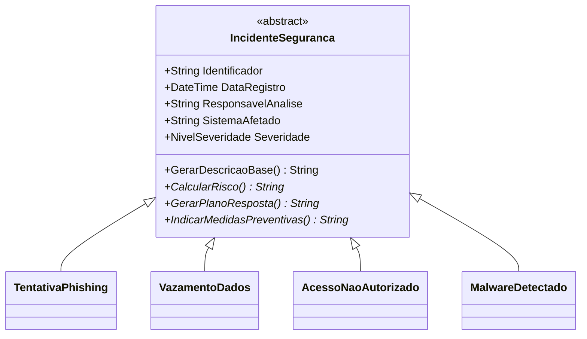

# Sistema de Gestão de Incidentes de Segurança da Informação

Este repositório contém o projeto desenvolvido para a Atividade Avaliativa — Polimorfismo em C# da disciplina de Programação Orientada a Objetos.

* Estudante: Luis Felipe Machado Dutra
* Problema Resolvido: Sistema de Gestão de Incidentes de Segurança da Informação (Enunciado 20)

---

## Sobre o Projeto

O sistema foi modelado para registrar e gerenciar incidentes de segurança da informação em uma organização de forma uniforme e extensível. Os incidentes implementados são:
1. Tentativa de Phishing: Incidentes envolvendo links falsos e mensagens maliciosas enviadas por diversos canais.
2. Vazamento de Dados: Incidentes de perda ou exposição de registros sensíveis de usuários (alinhado aos conceitos da LGPD).
3. Acesso Não Autorizado: Tentativas ou logins reais com credenciais inválidas ou a partir de origens suspeitas.
4. Malware Detectado: Detecção de vírus ou malwares complexos (como Ransomware) em servidores ou estações de trabalho.

---

## Conceitos de POO e Polimorfismo Aplicados

Este projeto demonstra boas práticas de Orientação a Objetos no ecossistema C# (.NET 10):

* Abstração & Herança: A classe abstrata `IncidenteSeguranca` concentra todos os atributos em comum (ID, Data, Responsável, Sistema Afetado, Severidade) e realiza a validação desses parâmetros no construtor.
* Polimorfismo: Os comportamentos de risco (`CalcularRisco()`), resposta (`GerarPlanoResposta()`) e prevenção (`IndicarMedidasPreventivas()`) são implementados como métodos abstratos na base e sobrescritos com `override` em cada classe filha, permitindo a variação dinâmica do comportamento sem acoplamento.
* Coleção Polimórfica: A classe de serviço `GerenciadorIncidentes` armazena e expõe os objetos sob a abstração da classe base em uma lista `List<IncidenteSeguranca>`.
* Ausência de Condicionais de Tipo: O relatório gerado no terminal percorre a lista polimórfica e invoca as assinaturas abstratas. Não há verificações de tipo (`if`, `switch` ou `is`) no código consumidor.

---

## Estrutura de Classes



---

## Organização de Pastas

```text
├── IncidentesSeguranca.slnx    # Arquivo de Solução C#
├── Incidentes.Dominio/          # Biblioteca de Classes (Camada de Domínio)
│   ├── Enums/
│   │   └── NivelSeveridade.cs
│   ├── Modelos/
│   │   ├── IncidenteSeguranca.cs (Base Abstrata)
│   │   ├── TentativaPhishing.cs
│   │   ├── VazamentoDados.cs
│   │   ├── AcessoNaoAutorizado.cs
│   │   └── MalwareDetectado.cs
│   └── Servicos/
│       └── GerenciadorIncidentes.cs
├── Incidentes.ConsoleApp/       # Projeto Console (Execução e Testes)
│   └── Program.cs
└── README.md
```

---

## Como Executar

### Pré-requisitos
* .NET SDK 10 ou superior instalado.

### Comandos

1. Clone o repositório (após submetido ao GitHub):
   ```bash
   git clone <url-do-repositorio>
   cd atividade-polimorfismo-poo
   ```

2. Compile a solução:
   ```bash
   dotnet build
   ```

3. Execute a aplicação console de testes:
   ```bash
   dotnet run --project Incidentes.ConsoleApp
   ```
